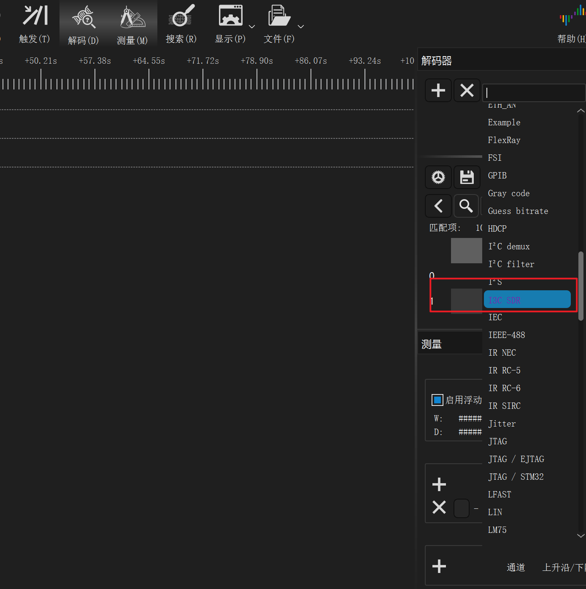
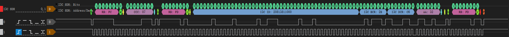
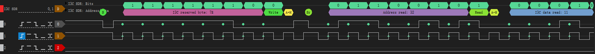
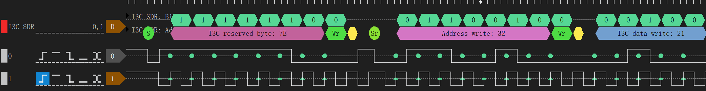
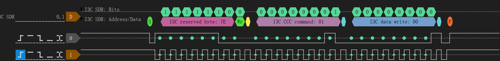
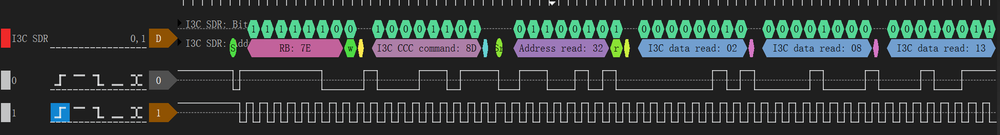

# I3C SDR Decoder

基于 [DSView](https://github.com/DreamSourceLab/DSView) 平台的 I3C SDR（Single Data Rate）协议解码器。

> 当前仅支持 I3C SDR 模式，HDR 模式将在后续版本中支持。

## 功能特性

| 功能 | 说明 |
|------|------|
| 动态地址分配（DAA） | Master 动态分配从机地址 |
| Private Read | 私有读传输 |
| Private Write | 私有写传输 |
| Broadcast CCC | 广播通用命令 |
| Direct CCC | 直接通用命令 |
| IBI（In-Band Interrupt） | 带内中断 |
| 奇偶校验检测 | 自动检测 Tbit / PAR 校验错误并标记警告 |
| 地址格式切换 | 支持 shifted / unshifted 两种地址显示格式 |

## 环境要求

- **DSView** >= v1.3.2（解码器依赖部分 API，低版本可能不兼容）
- 信号通道：`SCL`（时钟）、`SDA`（数据）

## 安装方法

1. 安装 DSView 平台
2. 打开 DSView 安装目录，找到 `decoders` 文件夹
3. 将 `i3c_sdr` 目录复制到 `decoders` 下
4. 重启 DSView，在协议解码器列表中搜索 **I3C SDR** 即可使用



## 解码效果

### 动态地址分配（DAA）

Master 发送保留字节 `0x7E`，从机返回 48-bit ID、BCR、DCR，Master 分配 7-bit 动态地址。



### Private Read



### Private Write



### Broadcast CCC



### Direct CCC



## 目录结构

```
i3c_sdr_decoder/
├── i3c_sdr/                    # 解码器源码
│   ├── __init__.py
│   └── pd.py                   # 主解码逻辑
├── test/                       # 测试数据（DSView .dsl 文件）
│   ├── dynamic_address.dsl
│   ├── private_read.dsl
│   ├── private_write.dsl
│   ├── broadcast_ccc.dsl
│   └── direct_ccc.dsl
├── i3c_basic_specification/    # I3C Basic 规范文档
├── img/                        # 截图
├── README.MD                   # 中文说明
└── README_EN.md                # 英文说明
```

## 参考资料

- [MIPI I3C Basic Specification v1.1.1](./i3c_basic_specification/mipi_I3C-Basic_specification_v1-1-1.pdf)